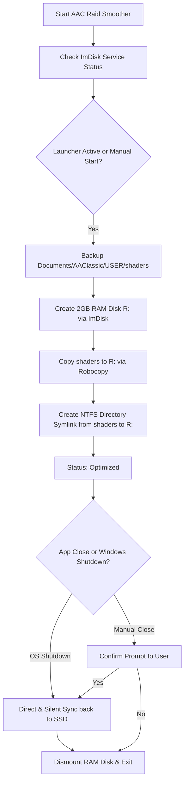

# 🚀 AAC Raid Smoother

Welcome to **AAC Raid Smoother**. This guide will help you quickly and easily improve your *ArcheAge Classic* gaming performance during heavy raids by loading your shader cache directly into the system's ultra-fast RAM.

---

## 📖 Part 1: User Guide

### 1. Critical Requirement: Install ImDisk 🛠️
Before using this tool, the **ImDisk Virtual Disk Driver** must be installed on your computer. This driver allows the tool to create a temporary virtual disk inside your RAM.

*   **How to install ImDisk:**
    1. Download and install the latest version of the ImDisk Virtual Disk Driver (available online for free):
    
    Direct link to install package: https://static.ltr-data.se/files/           imdiskinst.exe
    Github: https://github.com/LTRData/ImDisk
 
---

### 2. How to Use the Program (Step-by-Step) 🎮
The tool is designed to be extremely simple. Follow these steps:

1.  **Run as Administrator:**
    *   Right-click `AAC_Raid_Smoother.exe` and select **Run as administrator**. This is mandatory because the application requires privileges to mount drives and create symbolic folder links.
2.  **Choose Your Mode:**
    *   **Manual Optimization:** Click the **Optimize** button. The tool will mount the virtual disk (R:) and automatically move your shaders folder to the RAM disk.
    *   **Automatic Optimization (Recommended):** Check the box **"Automatically optimize when launcher starts"**. The tool will run quietly in the background and apply the optimization automatically as soon as the game launcher starts.
3.  **Enjoy Gaming!**
    *   Start ArcheAge Classic. Your shaders will now be loaded directly from your RAM instead of your SSD/HDD, resulting in significantly fewer stutters and faster loading times during intensive raids.
4.  **Restore Settings When Finished:**
    *   When you are done playing and want to close the app, it will automatically prompt you to restore your settings.
    *   Click **Yes** (or click the **Restore** button manually). Your shaders will be safely written back to your SSD, and the temporary RAM disk will be cleanly unmounted.
    *   *Note:* If your computer shuts down or restarts while the tool is running, your shaders will automatically and silently write back to your SSD within 2 seconds to prevent any data loss.

---

## 💻 Part 2: Technical Documentation

### System Components & Workflow
The application acts as an automated orchestrator between the Windows OS layer, the ImDisk kernel driver, and NTFS file system hooks.

### Technical Implementation Details:
1.  **DPI Scaling Layout:** The UI uses a dynamic `TableLayoutPanel` and `AutoScaleMode.Dpi` to ensure that the layout, fonts, and controls scale natively on high-DPI monitors (100% to 200%+) without text clipping or overlapping.
2.  **Directory Virtualization Paths:** The application redirects:
    *   *Target Directory:* `Documents\AAClassic\USER\shaders` (resolved via C#'s `Environment.SpecialFolder.MyDocuments`).
    *   *Backup Directory:* `Documents\AAClassic\USER\shaders_Backup`.
3.  **RAM Disk Creation:** Communicates with the installed driver using `imdisk.exe` to instantiate a 2 GB NTFS partition mapped under drive letter `R:`.
4.  **Robocopy Sync Engine:** Moves files using `robocopy.exe`. To prevent access denied errors or file locking issues with root-level system folders, the restore execution explicitly excludes system/hidden files and directories:
    `robocopy.exe "R:" "[userPath]" /E /XD "System Volume Information" "$RECYCLE.BIN" /R:1 /W:1 /NP /NFL /NDL`
5.  **NTFS Directory Symbolic Link:** Replaces the original shaders directory with a symbolic link (`mklink /d`) pointing to `R:\` so the game client seamlessly reads/writes files from RAM without configuration changes.

---

### Integrity & Recovery Rules
*   **Backup Buffering:** Shaders are backed up inside `shaders_Backup` before any virtualization begins.
*   **Shutdown Hook:** Intercepts the `WindowsShutDown` message during the WinForms closing sequence, bypassing dialog boxes and running a fast synchronous write-back to satisfy Windows' strict shutdown execution timeout.
